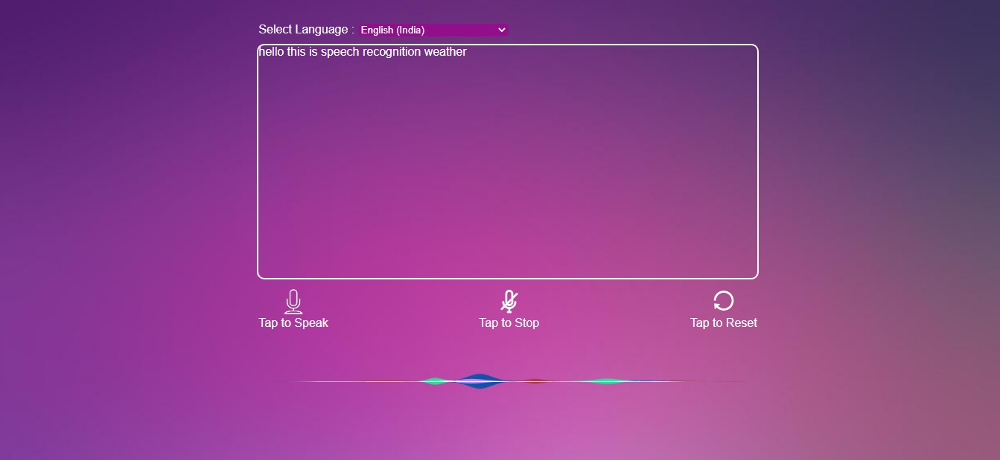

# Speech Recognition

## Description :
Speech Recognition web app is a user-friendly application built using **ReactJS**, a popular JavaScript library for building user interfaces. The app incorporates speech recognition technology, enabling users to interact with it through their voice. It supports 76 languages, making it accessible to a wide global users.

## Key features of the app include:

- Speech Recognition: The app leverages speech recognition to  transcribe users' spoken words into text. This eliminating the need for traditional input methods like typing.

- Multi-Language Support: With support for 76 languages,  Users can conveniently transcribe in their native languages.

- Real-Time Transcription: The speech recognition process occurs in real-time, enabling users to see their spoken words instantly transformed into text. This feature ensures efficient communication and minimizes any delays in interaction.

- Copy to Clipboard: The app also offers a "Copy to Clipboard" option, allowing users to easily copy the transcribed text to their device's clipboard. This functionality facilitates quick sharing of transcriptions or allows users to copy the text for later use.

- Intuitive User Interface: The app's user interface is user-friendly, making it accessible to all users. It offers a seamless and enjoyable experience for both casual and frequent users.

- Responsive Design: The app is built with a responsive design, ensuring it adapts to various devices and screen sizes. Whether accessed from a desktop, tablet, or mobile phone, users can enjoy a consistent and optimized experience.

Following ReactJS contents are used :
 -   ####  Components
 -   ####  CSS Modules
 -   ####  React Hooks
 -   ####  useState
 -   ####  Events
 -   ####  Packages

### Packages installed :

- npx create-react-app 

- react-speech-recognition 

- react-siriwave 

- react-copy-to-clipboard 

# How It Works :

#### react-speech-recognition

A React hook that converts speech from the microphone to text and makes it available to your React components.

useSpeechRecognition is a React hook that gives a component access to a transcript of speech picked up from the user's microphone.

SpeechRecognition manages the global state of the Web Speech API, exposing functions to turn the microphone on and off.

Under the hood, it uses Web Speech API.

The **Web Speech API** enables you to incorporate voice data into web apps.

**Web Speech API docs: On Chrome, using Speech Recognition on a web page involves a server-based recognition engine. Your audio is sent to a web service for recognition processing, so it won't work offline.**

### Requirements - 

- Web Browser
- microphone
- Internet connection

## Screenshots

# Technologies Used

- ReactJS
- CSS
